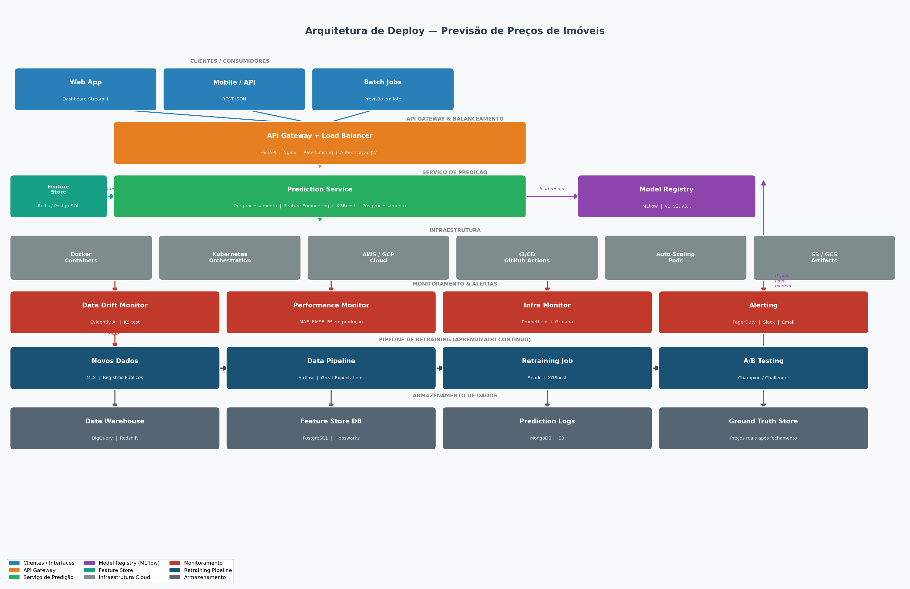
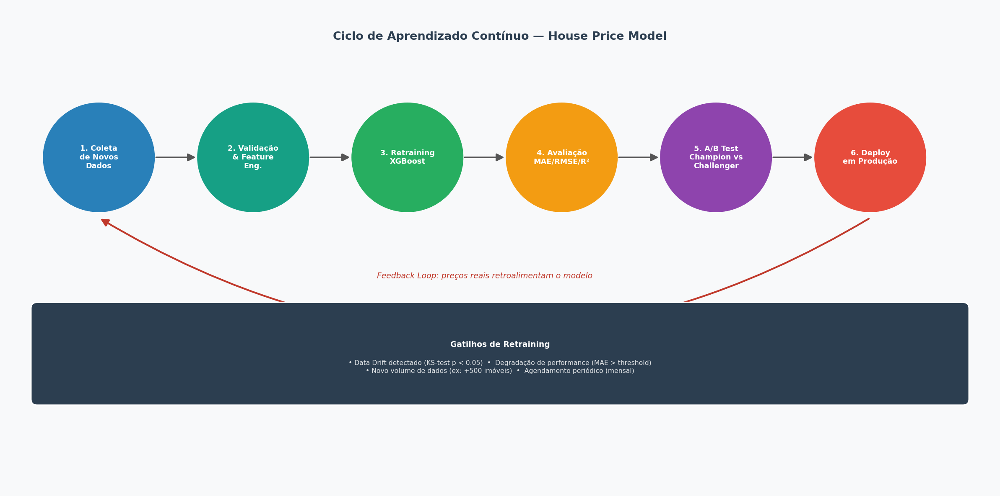

# House Price Prediction — Seattle, WA

Solução completa de previsão de preços de imóveis residenciais na região de Seattle (EUA), desenvolvida como resposta ao Desafio de Data Science.

---

## Resultados do Modelo

| Métrica | Valor |
|---------|-------|
| **R²** | 0.9138 |
| **MAE** | $63,127 |
| **RMSE** | $114,173 |
| **MAPE** | 11.56% |

O modelo **XGBoost** foi selecionado após comparação com Ridge Regression, Random Forest e Gradient Boosting via 5-Fold Cross-Validation.

---

## Estrutura do Projeto

```
house_price_project/
├── data/
│   ├── kc_house_data.csv           # Dados históricos com preços (21.613 imóveis)
│   ├── zipcode_demographics.csv    # Dados demográficos por CEP (70 zipcodes)
│   └── future_unseen_examples.csv  # Imóveis sem preço para previsão (100 imóveis)
├── notebooks/
│   ├── 01_eda.py                   # Análise Exploratória de Dados
│   ├── 02_modeling.py              # Feature Engineering + Modelagem + Previsões
│   └── 03_deploy_diagram.py        # Geração dos diagramas de arquitetura
├── outputs/
│   ├── merged_dataset.csv          # Dataset unificado (físico + demográfico)
│   ├── descriptive_stats.csv       # Estatísticas descritivas
│   ├── predictions_future.csv      # Previsões para os 100 imóveis
│   ├── model_metrics.json          # Métricas do modelo
│   └── *.png                       # Todos os gráficos gerados
└── diagrams/
    ├── deploy_architecture.png     # Diagrama completo de deploy
    └── continuous_learning.png     # Ciclo de aprendizado contínuo
```

---

## 1. Análise e Entendimento dos Dados

### Datasets utilizados

**`kc_house_data.csv`** — 21.613 imóveis com 21 variáveis:
- **Preço:** variável alvo (mediana $450k, máximo $7.7M)
- **Área:** `sqft_living`, `sqft_lot`, `sqft_above`, `sqft_basement`, `sqft_living15`, `sqft_lot15`
- **Estruturais:** `bedrooms`, `bathrooms`, `floors`, `grade`, `condition`, `yr_built`, `yr_renovated`
- **Localização:** `zipcode`, `lat`, `long`
- **Especiais:** `waterfront` (vista para água), `view` (score 0-4)

**`zipcode_demographics.csv`** — 70 zipcodes com 27 variáveis demográficas:
- Renda mediana domiciliar (`medn_hshld_incm_amt`)
- Valor mediano de imóveis por região (`hous_val_amt`)
- Percentual de graduados (`per_bchlr`, `per_prfsnl`)
- Perfil urbano/suburbano/rural

### Qualidade dos dados
- **0 valores nulos** em ambos os datasets
- **2 duplicatas** removidas
- Merge por `zipcode` sem perda de registros

### Principais correlações com o preço
1. `sqft_living` (0.70) — área interna é o maior preditor físico
2. `grade` (0.67) — qualidade de construção
3. `sqft_above` (0.60) — área acima do solo
4. `hous_val_amt` (0.63) — valor médio dos imóveis na região
5. `medn_hshld_incm_amt` (0.48) — renda mediana do bairro
6. `waterfront` — imóveis com vista para água custam em média 3x mais

### Padrões relevantes
- Distribuição de preços com **cauda longa à direita** → aplicamos `log1p` no target
- Zipcodes de Mercer Island (98040) e Bellevue (98004, 98005) lideram em preço
- Educação superior (`per_bchlr`, `per_prfsnl`) tem correlação positiva com preço
- Sazonalidade: pico de preços de março a julho

---

## 2. Desenvolvimento do Modelo de Machine Learning

### a. Feature Engineering

Além das variáveis originais, foram criadas:

| Feature | Descrição |
|---------|-----------|
| `age` | Idade do imóvel (2015 - yr_built) |
| `was_renovated` | Flag binária de renovação |
| `years_since_reno` | Anos desde última renovação (ou construção) |
| `sqft_ratio` | Proporção área/lote |
| `basement_ratio` | Proporção porão/área total |
| `grade_sqft` | Interação grade × área interna |
| `grade_age` | Interação grade × idade |
| `bath_bed_ratio` | Ratio banheiros/quartos |
| `income_grade` | Interação renda do bairro × qualidade |
| `high_season` | Flag de alta temporada (mar-jul) |

**Total: 36 features** (físicas + geográficas + engenhadas + demográficas)

### b. Escolha do Modelo

**Comparação via 5-Fold Cross-Validation:**

| Modelo | RMSE (log) | ±Std |
|--------|-----------|------|
| Ridge Regression | 0.2020 | ±0.0034 |
| Random Forest | 0.1757 | ±0.0035 |
| Gradient Boosting | 0.1633 | ±0.0018 |
| **XGBoost** | **0.1620** | **±0.0020** |

**XGBoost foi escolhido porque:**
- Melhor RMSE e menor desvio padrão entre folds → mais estável
- Lida nativamente com features não-lineares e interações complexas
- Regularização L1 e L2 (reg_alpha=0.1, reg_lambda=1.0) previne overfitting
- Eficiente para datasets de tamanho médio (~20k registros)
- Ótima interpretabilidade via importância de features

**Hiperparâmetros utilizados:**
```python
XGBRegressor(
    n_estimators=500,
    learning_rate=0.05,
    max_depth=6,
    subsample=0.8,
    colsample_bytree=0.8,
    reg_alpha=0.1,
    reg_lambda=1.0
)
```

### c. Generalização

Estratégias para garantir generalização:
1. **Train/Test Split:** 80/20 com `random_state=42` — dados de teste nunca vistos no treino
2. **5-Fold Cross-Validation:** avaliação robusta em 5 conjuntos distintos
3. **Log-transformação do target:** estabiliza a variância, melhora predição em altos valores
4. **Regularização L1+L2:** penaliza complexidade, reduz overfitting
5. **Subsampling:** `subsample=0.8` e `colsample_bytree=0.8` para diversidade de árvores
6. **Separação de features de data:** `year_sold`, `month_sold` usados apenas como features, nunca como proxies do target

---

## 3. Estratégia de Deploy

### Diagrama de Arquitetura



### Camadas da solução

| Camada | Tecnologia | Função |
|--------|-----------|--------|
| **Interface** | Streamlit / REST API | Entrada de dados pelo usuário ou sistema externo |
| **API Gateway** | FastAPI + Nginx | Balanceamento, autenticação JWT, rate limiting |
| **Prediction Service** | Docker container | Pré-processamento, feature engineering, inferência |
| **Model Registry** | MLflow | Versionamento e carregamento do modelo correto |
| **Feature Store** | Redis + PostgreSQL | Cache de features demográficas por zipcode |
| **Infraestrutura** | Kubernetes + AWS/GCP | Auto-scaling, alta disponibilidade |
| **CI/CD** | GitHub Actions | Deploy automático após aprovação de testes |
| **Monitoramento** | Prometheus + Grafana + Evidently | Métricas de infra e performance do modelo |
| **Alertas** | PagerDuty + Slack | Notificação em caso de degradação |
| **Storage** | S3 + BigQuery | Dados históricos, logs de predição, ground truth |

### Fluxo de uma predição em produção

```
1. Cliente envia características do imóvel via POST /predict
2. API Gateway valida autenticação e formata requisição
3. Prediction Service carrega features demográficas do Feature Store (Redis)
4. Feature Engineering aplicado em tempo real
5. XGBoost (versão ativa no MLflow) gera predição
6. Log da predição salvo no MongoDB para monitoramento
7. Resposta JSON retornada em < 200ms
```

---

## 4. Aprendizado Contínuo

### Diagrama do Ciclo



### Pipeline de retraining

```
Novos Dados → Validação → Retraining → Avaliação → A/B Test → Deploy
      ↑                                                              |
      └──────────── Feedback Loop (preços reais) ───────────────────┘
```

### Gatilhos de retraining

| Gatilho | Critério |
|---------|---------|
| **Data Drift** | KS-test detecta mudança na distribuição (p < 0.05) |
| **Performance** | MAE em produção > 15% acima do baseline |
| **Volume** | Acúmulo de 500+ novos imóveis com preço real |
| **Agendado** | Retraining mensal independentemente das métricas |

### Processo de atualização segura

1. **Validação de dados:** Great Expectations verifica schema e qualidade
2. **Retraining:** Airflow orquestra o pipeline completo
3. **Avaliação offline:** modelo novo deve superar o atual em 3 métricas
4. **A/B Testing:** 10% do tráfego vai para o novo modelo por 7 dias
5. **Promoção automática:** se novo modelo mantém performance → vira Champion
6. **Rollback automático:** se performance cair → versão anterior é restaurada

### Fonte de ground truth

Preços reais de fechamento obtidos via:
- APIs de registros públicos de imóveis (King County Assessor)
- Parceiros da corretora após fechamento da venda
- Retroalimentação automática com delay de 30-90 dias

---

## 5. Comunicação com Stakeholders

### Métricas traduzidas para o negócio

| Métrica Técnica | Interpretação de Negócio |
|----------------|--------------------------|
| MAE = $63.127 | Em média, o modelo erra $63k no preço de avaliação |
| R² = 0.91 | O modelo explica 91% da variação nos preços de mercado |
| MAPE = 11.6% | Erro percentual médio de ~12% — aceito para avaliação imobiliária |
| RMSE = $114k | Casos mais extremos (outliers) têm erro de até $114k |

### Valor de negócio estimado

- **Avaliação rápida:** tempo de avaliação de imóvel passa de 2-3 dias para segundos
- **Precificação consistente:** elimina variação subjetiva entre avaliadores
- **Escala:** capacidade de avaliar centenas de imóveis por minuto
- **Confiança:** 91% de explicabilidade transmite credibilidade ao cliente

### Visualizações geradas

| Gráfico | Insight para o negócio |
|---------|----------------------|
| `01_price_distribution.png` | Mediana do mercado em $450k |
| `05_waterfront_view.png` | Vista para água = +200% no preço |
| `07_price_by_zipcode.png` | Top bairros para investimento |
| `08_income_vs_price.png` | Correlação renda-preço por região |
| `12_feature_importance.png` | O que mais influencia o preço |
| `15_business_metrics.png` | Precisão do modelo por faixa de preço |

---

## Como Executar

```bash
# 1. Clone o repositório
git clone https://github.com/SEU_USUARIO/HOUSE_PRICE_PREDICTION.git
cd HOUSE_PRICE_PREDICTION/house_price_project

# 2. Instale as dependências
pip install pandas numpy matplotlib seaborn scikit-learn xgboost

# 3. Execute a EDA
python notebooks/01_eda.py

# 4. Execute a modelagem e gere as previsões
python notebooks/02_modeling.py

# 5. Gere os diagramas de deploy
python notebooks/03_deploy_diagram.py

# Os resultados estarão em outputs/ e diagrams/
```

---

## Previsões Geradas

As previsões para os 100 imóveis sem preço estão em `outputs/predictions_future.csv`:

- **Mediana prevista:** $422.856
- **Mínimo:** $143.173
- **Máximo:** $2.036.118

---

## Tecnologias Utilizadas

- **Python 3.12** | **Pandas** | **NumPy** | **Matplotlib** | **Seaborn**
- **Scikit-learn** — Cross-validation, métricas, Ridge, Random Forest, Gradient Boosting
- **XGBoost** — Modelo final selecionado
- **MLflow** *(design de deploy)* | **FastAPI** *(design de deploy)* | **Evidently** *(design de deploy)*
